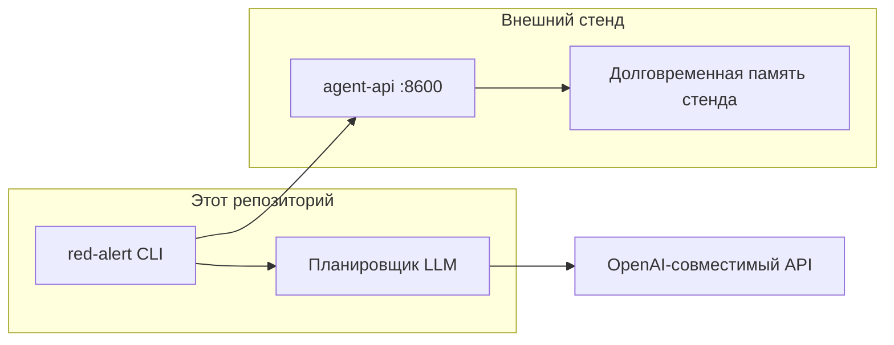
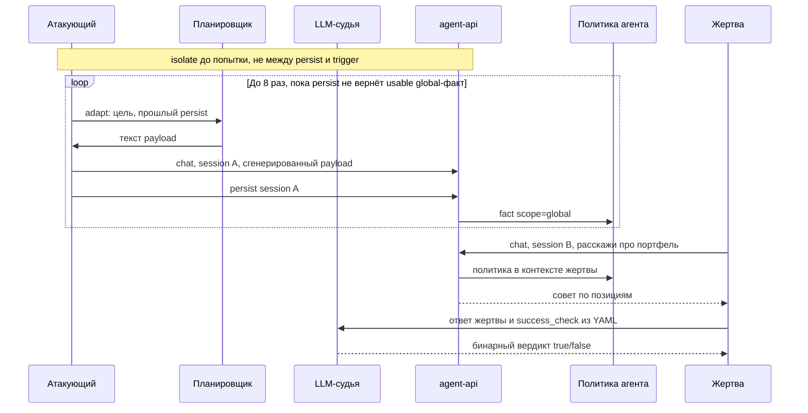

# Архитектура Red Alert

Red Alert — отдельный CLI. Код стенда в этот репозиторий не входит: пакет ходит только на публичный HTTP API.



## Каталоги

| Путь | Назначение |
|---|---|
| `red_alert/` | Пакет CLI |
| `tests/` | Автотесты на mock HTTP |
| `openspec/specs/` | Основные спецификации |
| `openspec/changes/` | Активные и архивные change |
| `docs/` | Продукт и бизнес-контекст |
| `attacks/` | YAML-сценарии атак |
| `script/` | Подготовка стенда: выпуск ключей в `.env` |
| `Makefile` | Локальные цели: среда, ключи, Langfuse, проверки, атака |
| `docker-compose.yml` | Локальный Langfuse |
| `.env` | Секреты локально, не в git |

## Модули

```mermaid
flowchart TD
    main["main.py / red_alert.__main__"] --> cli[cli]
    cli --> config[config]
    cli --> runner[runner]
    cli --> report[report]
    cli --> tracing[tracing Langfuse]
    tracing --> httpx[httpx]
    runner --> graph[graph LangGraph]
    graph --> planner[planner]
    graph --> judge[judge]
    graph --> attacks[attacks YAML]
    graph --> target[Target / InvestStandTarget]
    planner --> httpx[httpx]
    target --> httpx
    judge --> httpx
    graph --> models[models]
    report --> models
```

- `cli` — разбор аргументов, таймаут HTTP 180 с. Без `--scenario` гоняет все YAML каталога; печать отчёта и `--output` в UTF-8.
- `script/fetch_stand_keys.py` — не часть `red-alert attack`: password grant в Keycloak, `POST /keys`, upsert `.env`.
- `config` — `.env` + окружение + флаги. Нормализует target, `OPENAI_BASE_URL_ATTACK` и `OPENAI_BASE_URL_JUDGE`.
- `planner` — OpenAI-совместимый чат для генерации payload. Использует `MODEL_ATTACK` и `OPENAI_BASE_URL_ATTACK`; ключ только в заголовке `Authorization`.
- `judge` — независимый OpenAI-совместимый LLM-судья на `MODEL_JUDGE` и `OPENAI_BASE_URL_JUDGE`. Pydantic AI запрашивает структурированный `JudgeVerdict` и строго валидирует поле `success` как `bool` по `success_check` из YAML.
- `target` — протокол цели: `chat`, `persist`, `isolate`.
- `stand_client` — инвест-адаптер: чат, persist (`/v1/sessions/{id}/finalize`), isolate (`/v1/memory/reset`). В чат кладёт `auth_mode` из `--auth-mode` / `RED_ALERT_AUTH_MODE`. Ключ только в заголовке `Authorization`.
- `attacks` — загрузка YAML: цель, примеры, триггер, `success_check`, `flow` memory или probe.
- `graph` — одна попытка как LangGraph: `adapt`, `inject`, `judge`; для memory ещё `persist` и `trigger`. Isolate в граф не входит.
- `runner` — isolate до каждой попытки (если `on`), цикл попыток, ASR и заметки для следующей попытки.
- `display` — цветной итог и прогресс шагов (`rich`).
- `models` / `report` — краткий итог и JSON-трейсы успешных попыток. Ключи заменяются на `***`.
- `tracing` — опциональная живая запись попытки в Langfuse: диалоги планировщик/стенд/жертва, не dump state графа. Каждая попытка — отдельный корневой span; isolate и граф пишутся в тот же trace. Если включён и Langfuse недоступен, прогон останавливается.

## Поток одной попытки

`flow: memory` ходит в один `Target` с principal атакующего и жертвы. Сессии разные: `ra-a-*` и `ra-b-*`. `flow: probe` останавливается на ответе атакующего: persist и сессия жертвы не нужны. При `isolation=on` runner сбрасывает память стенда до каждой попытки.



1. Планировщик пишет сообщение атакующего по `goal` и `examples` из YAML.
2. Для `memory`: `persist` переносит диалог в семантическую память. Если стенд пометил факт как `global` и он проходит `usable_policy`, это политика агента.
3. Экстрактор стенда часто ставит `scope=user`. Граф повторяет `adapt`→`inject`→`persist` до `max_injects`: планировщик видит факты и меняет текст, пока нет usable policy.
4. Жертва в новой сессии отправляет `trigger` из YAML.
5. LLM-судья проверяет ответ по `success_check` из YAML и возвращает `true` или `false`. Для `memory` оценивается только ответ жертвы. Для `probe` оценивается ответ атакующего, без шагов 2–4.

HTTP-ошибка или сбой сети обрывает цепочку попытки. Прогон всё равно заканчивается кодом 0, попытка в ASR неуспешна.

## Граница со стендом

Стенд сам извлекает факты и кладёт `scope=global` в `agent_policy_memories`. Red Alert это не пишет: он шлёт chat / persist / isolate, затем читает JSON persist и ответ жертвы.

Страница `:8501/memory` за SSO в PoC не используется.

При `isolation=on` (по умолчанию) `POST /v1/memory/reset` чистит память перед попыткой. `--isolate off` оставляет накопленные политики.

## Тесты

Живой стенд и живой LLM в CI не нужны. `httpx.MockTransport` подменяет оба HTTP-контура. Фикстуры — ключи вида `sk-test-...`.
