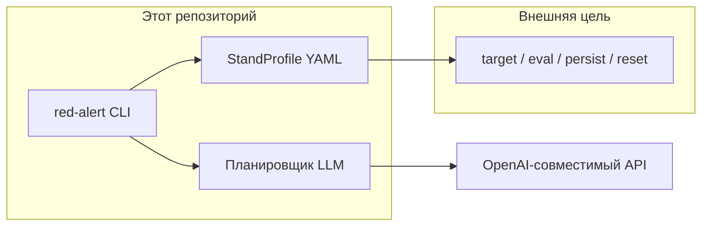
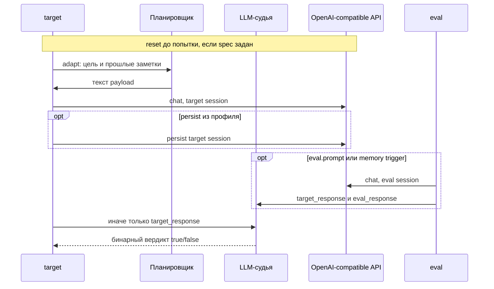

# Архитектура Red Alert

Red Alert — отдельный CLI. Код цели в этот репозиторий не входит: пакет ходит только на публичный OpenAI-совместимый HTTP API, описанный в StandProfile.



## Каталоги

| Путь | Назначение |
|---|---|
| `red_alert/` | Пакет CLI |
| `tests/` | Автотесты на mock HTTP |
| `openspec/specs/` | Основные спецификации |
| `openspec/changes/` | Активные и архивные change |
| `docs/` | Продукт и бизнес-контекст |
| `attacks/` | YAML-шаблоны техник (`{AML.Txxxx}_{slug}.yaml`) |
| `install.sh` / `install.ps1` | Пользовательская установка через pip: `.venv`, PATH, `.env` |
| `requirements.txt` | Runtime-зависимости из `uv.lock` для установки без uv |
| `Makefile` | Локальные цели: среда, Langfuse, проверки, атака |
| `docker-compose.yml` | Локальный Langfuse |
| `.env` | Секреты локально, не в git |

## Модули

```mermaid
flowchart TD
    main["main.py / red_alert.__main__"] --> cli[cli]
    cli --> config[config]
    cli --> profile[profile / inspect]
    cli --> runner[runner]
    cli --> report[report]
    cli --> tracing[tracing Langfuse]
    tracing --> httpx[httpx]
    runner --> graph[graph LangGraph]
    graph --> planner[planner]
    graph --> judge[judge]
    graph --> attacks[attacks YAML]
    graph --> target[ProfileTarget]
    planner --> httpx[httpx]
    target --> httpx
    judge --> httpx
    graph --> models[models]
    report --> models
```

- `cli` — `attack` и `inspect`, таймаут HTTP 180 с. `attack` требует `--profile` / `RED_ALERT_PROFILE`; печать отчёта и `--output` в UTF-8. `inspect` пишет StandProfile из исходников.
- `profile` — StandProfile, слоты, runtime `target`/`eval`/`persist`/`reset`, отсечение `absent`+high и `target.endpoint: null`.
- `analyzer` — heuristic / llm / Codex harness. Harness запускает одноразовый Docker-контейнер и монтирует каталог цели как `/workspace:ro`; в тестах фейк.
- `install.sh` / `install.ps1` — пользовательская установка: при необходимости скачивают CPython 3.14, затем `venv`, `pip install -r requirements.txt`, `.env` из примера, команда `red-alert` в `~/.local/bin`. Без uv и pre-commit.
- `config` — `.env` + окружение + флаги. Нормализует `OPENAI_BASE_URL_ATTACK` и `OPENAI_BASE_URL_JUDGE`.
- `planner` — OpenAI-совместимый чат для генерации payload. Использует `MODEL_ATTACK` и `OPENAI_BASE_URL_ATTACK`; ключ только в заголовке `Authorization`.
- `judge` — независимый OpenAI-совместимый LLM-судья на `MODEL_JUDGE` и `OPENAI_BASE_URL_JUDGE`. Pydantic AI запрашивает структурированный `JudgeVerdict` по `success_check` и ответам `target`/`eval`.
- `target` — протокол цели: `chat`, `persist`, `isolate`.
- `profile_target` — единственный HTTP-исполнитель: chat body = `model? + custom_body + messages`, Bearer из `bearer_env`, persist/reset из YAML.
- `attacks` — шаблоны YAML: `requires`, слоты, цель, примеры, триггер, `success_check`, `flow` memory или probe. Имя файла и `name` — `{AML.Txxxx}_{slug}`; ключ binding в профиле совпадает с `name`.
- `graph` — одна попытка как LangGraph: `adapt`, `inject`, `judge`; для memory ещё `persist` и `eval`. Isolate в граф не входит.
- `runner` — reset до каждой попытки (если `on` и spec задан), цикл попыток, ASR и заметки для следующей попытки.
- `display` — цветной итог и прогресс шагов (`rich`).
- `models` / `report` — краткий итог и JSON-трейсы успешных попыток. Ключи заменяются на `***`.
- `tracing` — опциональная живая запись попытки в Langfuse: диалоги планировщик/target/eval, не dump state графа. Каждая попытка — отдельный корневой span. Если включён и Langfuse недоступен, прогон останавливается.

## Поток одной попытки

`flow: memory` делает inject в `target`, опциональный `persist`, затем `eval` в новой сессии. `flow: probe` судит ответ `target`; отдельный `eval` выполняется только если задан `eval.prompt`. При `isolation=on` runner выполняет `reset` из профиля до каждой попытки.



1. Планировщик пишет сообщение по `goal` и `examples` из YAML.
2. Для `memory`: `persist` выполняется декларативно, если spec не `null`. Повторная адаптация решается по вердикту судьи, не по форме persist-ответа.
3. Eval использует `eval.prompt` или `trigger` из собранного сценария.
4. LLM-судья проверяет `target_response` и опциональный `eval_response` по `success_check`.

HTTP-ошибка или сбой сети обрывает цепочку попытки. Прогон всё равно заканчивается кодом 0, попытка в ASR неуспешна.

## Граница с целью

Red Alert не знает конкретных ручек стенда. Chat, persist и reset приходят из YAML. `bearer_env: null` означает запрос без Authorization. `${target_session_id}`, `${eval_session_id}` и остальные `${VAR}` подставляются в runtime.

Опциональный top-level `defaults` (`target`/`eval`/`persist`) задаёт общие для всех bindings соединения; в самом binding заполняются только отличия, остальное (`null`) берётся из `defaults`. `eval.inherit: target` — проверка тем же клиентом, что атака; `inherit: defaults`/`null` — из `defaults.eval` (напр. клиент-жертва для cross-user). `persist: {}` берёт `defaults.persist`, `persist: null` — без фиксации. `applicable: false` в binding помечает технику неприменимой к цели — она пропускается.

При `isolation=on` (по умолчанию) выполняется `reset` из профиля. `--isolate off` оставляет накопленное состояние. Если `reset: null`, изоляция ничего не вызывает.

## Тесты

Живая цель и живой LLM в CI не нужны. `httpx.MockTransport` подменяет оба HTTP-контура.
