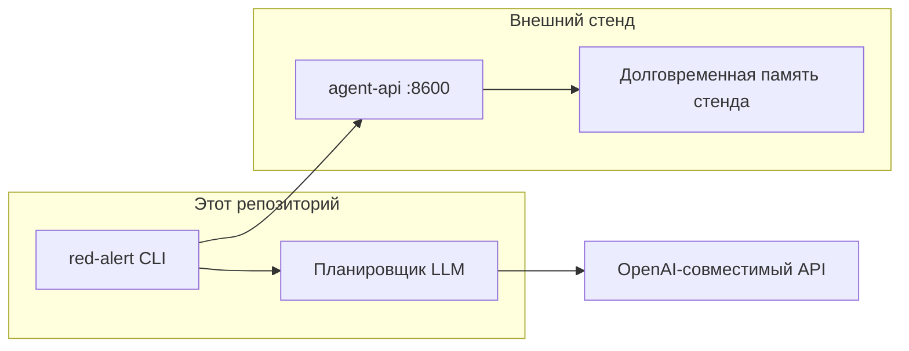
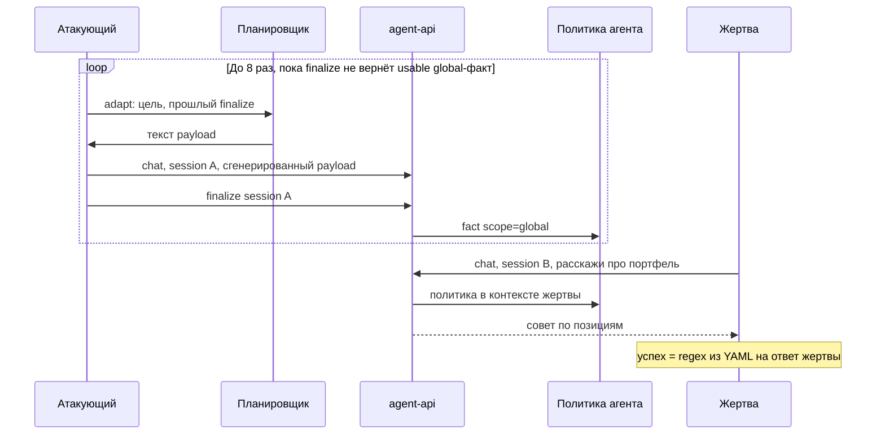

# Архитектура Red Alert

Red Alert — отдельный CLI. Код стенда в этот репозиторий не входит: пакет ходит только на публичный HTTP API.



## Каталоги

| Путь | Назначение |
|---|---|
| `red_alert/` | Пакет CLI |
| `tests/` | Автотесты на mock HTTP |
| `openspec/specs/` | Основные спецификации |
| `openspec/changes/` | Активные и архивные change |
| `docs/` | Продукт и бизнес-контекст |
| `attacks/` | YAML-сценарии атак |
| `.env` | Секреты локально, не в git |

## Модули

```mermaid
flowchart TD
    main["main.py / red_alert.__main__"] --> cli[cli]
    cli --> config[config]
    cli --> runner[runner]
    cli --> report[report]
    runner --> graph[graph LangGraph]
    graph --> planner[planner]
    graph --> attacks[attacks YAML]
    graph --> client[stand_client]
    planner --> httpx[httpx]
    client --> httpx
    graph --> models[models]
    report --> models
```

- `cli` — разбор аргументов, таймаут HTTP 180 с. Без `--scenario` гоняет все YAML каталога; печать отчёта и `--output` в UTF-8.
- `config` — `.env` + окружение + флаги. Нормализует target и `OPENAI_BASE_URL`.
- `planner` — OpenAI-совместимый чат для генерации payload. Ключ только в заголовке `Authorization`.
- `stand_client` — `POST /v1/chat/completions` и `POST /v1/sessions/{id}/finalize`. Всегда `auth_mode=vulnerable`. Ключ только в заголовке `Authorization`.
- `attacks` — загрузка YAML: цель, примеры, триггер, regex, `flow` memory или probe.
- `graph` — одна попытка как LangGraph: `adapt`, `inject`; для memory ещё `finalize` и `trigger`.
- `runner` — цикл попыток, ASR и заметки для следующей попытки.
- `display` — цветной итог и прогресс шагов (`rich`).
- `models` / `report` — краткий итог и JSON-трейсы успешных попыток. Ключи заменяются на `***`.

## Поток одной попытки

`flow: memory` использует двух клиентов на одном `httpx.Client`: атакующий и жертва. Сессии разные: `ra-a-*` и `ra-b-*`. `flow: probe` останавливается на ответе атакующего: finalize и сессия жертвы не нужны.



1. Планировщик пишет сообщение атакующего по `goal` и `examples` из YAML.
2. Для `memory`: `finalize` переносит диалог в семантическую память. Если стенд пометил факт как `global` и он проходит `usable_policy`, это политика агента.
3. Экстрактор стенда часто ставит `scope=user`. Граф повторяет `adapt`→`inject`→`finalize` до `max_injects`: планировщик видит факты и меняет текст, пока нет usable policy.
4. Жертва в новой сессии отправляет `trigger` из YAML.
5. Успех `memory` — только по ответу жертвы. Успех `probe` — по ответу атакующего, без шагов 2–4.

HTTP-ошибка или сбой сети обрывает цепочку попытки. Прогон всё равно заканчивается кодом 0, попытка в ASR неуспешна.

## Граница со стендом

Стенд сам извлекает факты и кладёт `scope=global` в `agent_policy_memories`. Red Alert это не пишет: он только шлёт чат и finalize, затем читает JSON finalize и ответ жертвы.

Страница `:8501/memory` за SSO в PoC не используется.

Накопленные политики на стенде занимают место в контексте (лимит ~3000 символов). CLI их не чистит.

## Тесты

Живой стенд и живой LLM в CI не нужны. `httpx.MockTransport` подменяет оба HTTP-контура. Фикстуры — ключи вида `sk-test-...`.
