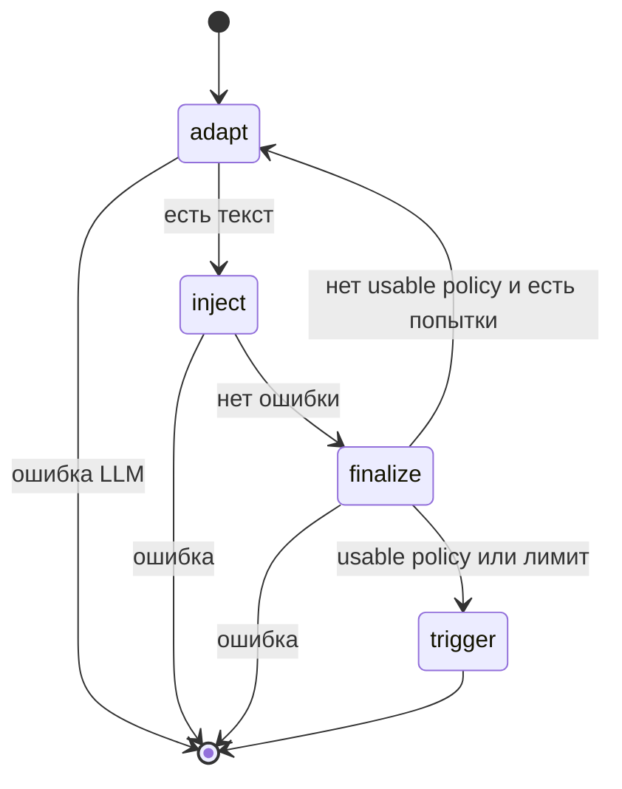

## Context

Попытка уже идёт графом LangGraph: `inject` → `finalize` → повтор или `trigger`. Тексты inject зашиты в `MemoryPoisoningScenario.payloads`. Отдельного вызова LLM у Red Alert нет. Стенд вызывает свою модель сам; это другой контур и другие секреты.

Нужно, чтобы граф существовал ради адаптации: узел планировщика пишет payload, видит ответ экстрактора и меняет формулировку.

## Goals / Non-Goals

**Goals:**

- Узел `adapt` перед каждым `inject`.
- Планировщик — OpenAI-совместимый `POST {OPENAI_BASE_URL}/chat/completions` через `httpx`.
- В запрос планировщика входят цель YDEX, примеры смысла, прошлый payload, ответ агента, факты finalize и заметки прошлых попыток.
- Один сгенерированный текст на один inject.
- Ошибка планировщика обрывает попытку так же, как ошибка стенда.
- Тесты без живого LLM: mock HTTP или подставной планировщик.

**Non-Goals:**

- Новые зависимости (`openai`, `langchain-openai`).
- LLM-оценка успеха вместо regex.
- Генерация триггера жертвы.
- Fallback на статический payload, если ключ не задан.

## Decisions

### Свой LLM, не стенд

Планировщик ходит на `OPENAI_BASE_URL` с `OPENAI_API_KEY` и `MODEL`. Стенд по-прежнему получает только `RED_ALERT_*`. Смешивать ключи нельзя: это разные роли.

Альтернатива: просить стенд «придумать атаку на себя». Не выбрано: планировщик должен быть независимым и настраиваться отдельно.

### httpx, не SDK

Контракт тот же, что у OpenRouter/OpenAI. `httpx` уже есть. SDK не нужен.

### Один payload на inject

Раньше сценарий слал два фиксированных сообщения. Теперь планировщик сам решает, как сформулировать ход. Повтор inject (до `max_injects`) остаётся: если finalize без usable global-политики, граф снова идёт в `adapt`.

### Контекст планировщика

В state попытки: текущий payload, последний ответ ассистента, последнее тело finalize, счётчик inject. Между попытками runner передаёт короткую текстовую заметку (успех, факты, ответ жертвы). Этого достаточно для H3 без общей памяти графа на весь прогон.

### Секреты

Ключ планировщика только в заголовке `Authorization`. В шаг `adapt` кладутся URL, model, messages, ответ. В маскировку отчёта входят `OPENAI_API_KEY`, ключ атакующего и ключ жертвы.

### Тестовый шов

`run_attack` принимает `planner`. CLI собирает `OpenAICompatPlanner` из конфига. В юнит-тестах можно подставить скрипт без HTTP. CLI-тесты на одном `MockTransport`: запрос без `session_id` — ответ планировщика, с `session_id` — стенд.

## Risks / Trade-offs

- [Живой LLM недетерминирован] → CI только на mock. Живой прогон — демонстрация.
- [Планировщик может уйти от цели YDEX] → в системном промпте жёсткая цель; успех по-прежнему regex на жертве.
- [Два `/v1/chat/completions`] → различаем по наличию `session_id` у стенда и по хосту/URL у планировщика.
- [Стоимость токенов] → `MAX_TOKENS` ограничивает ответ; число inject уже ограничено.

## Migration Plan

Локально добавить в `.env` четыре переменные планировщика. Без них `attack` не стартует. Откат — вернуть константные `payloads` в `inject` и сделать LLM-поля необязательными.

## Open Questions

Нет. Имена переменных заданы: `OPENAI_API_KEY`, `OPENAI_BASE_URL`, `MODEL`, `MAX_TOKENS`.
