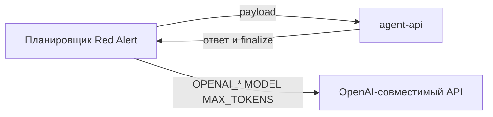

## Why

Фишка подхода Red Alert — не фиксированный список промптов, а свой LLM-планировщик: он пишет следующий ход атаки по ответу стенда. Сейчас LangGraph только повторяет зашитые payload, в LLM не ходит. Без этого граф не отличается от цикла, а переменные `OPENAI_API_KEY`, `OPENAI_BASE_URL`, `MODEL`, `MAX_TOKENS` ни на что не влияют.

## What Changes

- Перед каждым inject Red Alert вызывает свой OpenAI-совместимый LLM и получает текст сообщения атакующего.
- Планировщик видит цель сценария, прошлый payload, ответ агента, факты finalize и краткие заметки предыдущих попыток; при неудачном extract (например `scope=user`) пишет другой текст.
- Конфиг атаки требует `OPENAI_API_KEY` и `MODEL`; `OPENAI_BASE_URL` и `MAX_TOKENS` имеют значения по умолчанию.
- В доказательствах появляется шаг `adapt` (актор `planner`): запрос и ответ планировщика, без секрета в теле.
- Цель, триггер жертвы и regex успеха остаются прежними.

**BREAKING:** команда `attack` без ключа и модели планировщика завершается с кодом 2.

Не входит в этот change:

- LLM-as-a-judge вместо regex;
- генерация новых типов атак или других стендов;
- смена триггера жертвы через LLM;
- checkpoint, studio, отдельный граф на весь прогон.

## Capabilities

### New Capabilities

- `adaptive-planner`: Red Alert ходит в свой LLM и генерирует следующий payload по обратной связи стенда.

### Modified Capabilities

- `memory-poisoning`: текст inject больше не константа из кода, его пишет планировщик под ту же цель YDEX.
- `attack-cli`: для запуска нужны переменные планировщика.
- `attack-report`: в трейс успешной попытки входит шаг `adapt`.

## Impact

Меняются `config`, CLI, граф попытки, отчёт и `.env.example`. Новая зависимость SDK не нужна: планировщик вызывает `/chat/completions` через уже существующий `httpx`. Автотесты мокают и стенд, и LLM. Живой стенд по-прежнему не входит в CI.

