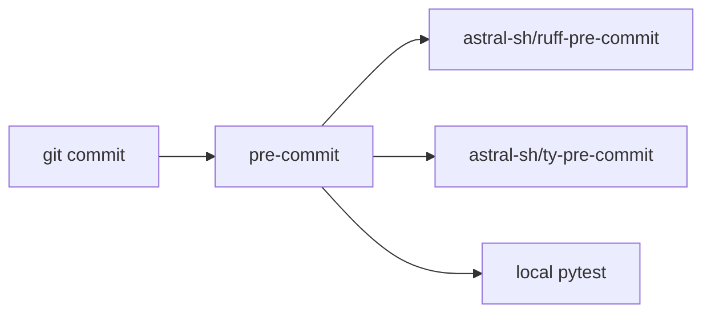

## Context

В проекте уже есть ruff и pytest в dev-зависимостях, а `pre-commit` добавлен в зависимости пакета. Самописных git-хуков быть не должно: только `.pre-commit-config.yaml`.

## Goals / Non-Goals

**Goals:**

- При коммите запускать ruff, ty и pytest.
- Брать ruff и ty из официальных pre-commit-репозиториев Astral.
- Версию ruff в хуке держать равной версии в `pyproject.toml`.

**Non-Goals:**

- Скрипты в `.git/hooks` или `core.hooksPath`.
- CI-пайплайн.
- Изменение набора lint-правил.

## Decisions

### Официальные хуки ruff и ty

Ruff: `https://github.com/astral-sh/ruff-pre-commit`, хуки `ruff-check` и `ruff-format`, `rev: v0.16.6` как у зависимости проекта. Линтер с `--fix`, затем форматтер — как в README хука.

Ty: `https://github.com/astral-sh/ty-pre-commit`, хук `ty`, `rev: v0.0.78`. Аргумент `--isolated`, чтобы хук не менял `uv.lock` и `.venv` при коммите.

### Pytest как local-хук

Отдельного официального pytest-репозитория для pre-commit нет. Хук объявляется в `repo: local`, `entry: uv run pytest`, `language: system`, без передачи имён файлов. Это конфиг pre-commit, а не самописный git-hook.

Альтернатива: дублировать pytest в `additional_dependencies` isolated-окружения. Не выбрано: тестам нужны зависимости проекта, их уже ставит `uv run`.

### Проверка конфига тестом

Тест читает `.pre-commit-config.yaml` и проверяет наличие репозиториев ruff/ty и хуков `ruff-check`, `ty`, `pytest`. Парсер YAML не нужен.

## Risks / Trade-offs

- Pytest на каждый коммит замедляет commit. Это запрошенное поведение.
- `language: system` для pytest требует, чтобы `uv` был в PATH.
- ty-pre-commit не работает на pre-commit.ci без сети; CI в этот change не входит.
