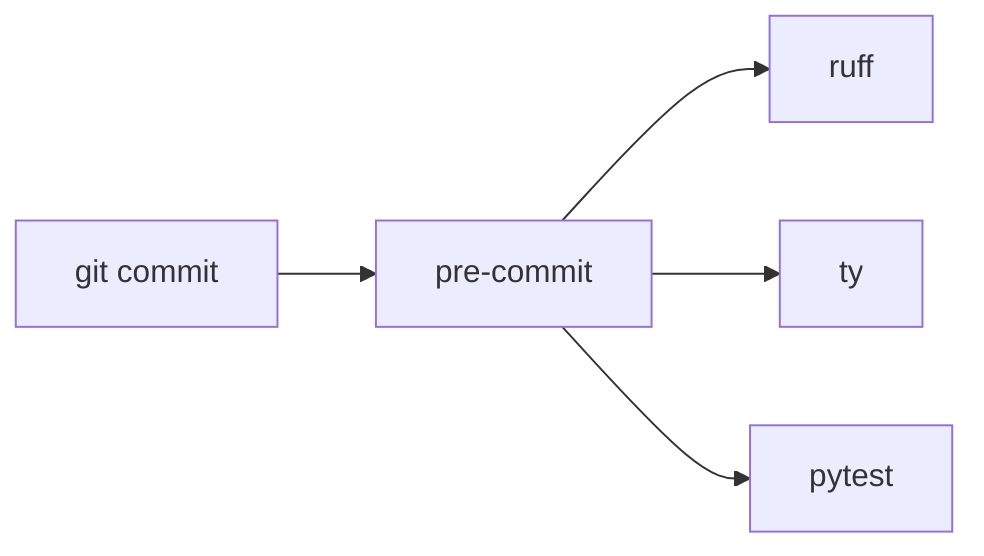

## Why

Коммиты сейчас не проверяют линтер, типы и тесты. Нужно, чтобы `git commit` сам прогонял ruff, ty и pytest через стандартный pre-commit, без самописных git-хуков.

## What Changes

- Добавить `.pre-commit-config.yaml` с хуками ruff, ty и pytest.
- Использовать официальные репозитории Astral для ruff и ty; pytest запускать как local-хук pre-commit.
- Покрыть конфиг тестом: в нём должны быть все три проверки.

Не входит в этот change:

- перенос `pre-commit` между группами зависимостей — пакет уже добавлен в проект;
- CI, pre-commit.ci и установка хуков на чужие машины;
- настройка правил ruff/ty сверх уже существующего `pyproject.toml`.

## Capabilities

### New Capabilities

- `pre-commit-hooks`: перед коммитом запускаются ruff, ty и pytest из `.pre-commit-config.yaml`.

### Modified Capabilities

Нет.

## Impact

Появляется конфиг pre-commit в корне репозитория. Зависимость `pre-commit` уже есть. После `pre-commit install` коммит блокируется, если линтер, проверка типов или тесты не проходят.

