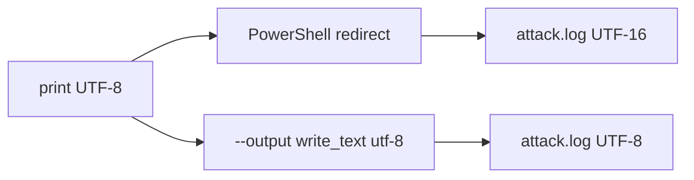

## Context

PowerShell 5 перенаправляет `>` через `Out-File` и пишет UTF-16 LE с BOM. Python уже печатает UTF-8 в консоль; после `>` байты перекодируются. Cursor и большинство редакторов открывают файл как UTF-8 и видят нули между символами.

## Goals / Non-Goals

**Goals:**

- Флаг `--output` пишет отчёт в UTF-8 без BOM.
- Содержимое файла совпадает с stdout, ключи маскируются.

**Non-Goals:**

- Ломать или эмулировать `>`.
- HTML/JSON-отчёт.

## Decisions

### Файл пишет Python

`Path.write_text(..., encoding="utf-8")` не зависит от кодовой страницы оболочки.

Альтернатива: просить `Out-File -Encoding utf8`. Не выбрано как единственное решение: легко забыть, в PowerShell 5 `utf8` всё равно с BOM.

### stdout не отключать

Флаг дополняет консоль, а не заменяет её. Если нужен только файл — можно по-прежнему глушить stdout, но файл уже будет читаемым.

## Risks / Trade-offs

- [Нет каталога для пути] → обычная ошибка записи, без отдельной обработки.
