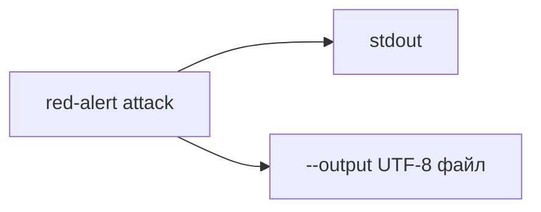

## Why

`uv run red-alert attack > attack.log` в PowerShell сохраняет отчёт в UTF-16. Редакторы ждут UTF-8, файл выглядит нечитаемым. Нужно писать лог самим процессом в UTF-8, не через редирект оболочки.

## What Changes

- Добавить у `red-alert attack` аргумент `--output` / `-o`: записать тот же отчёт в файл в UTF-8.
- Печать в stdout сохранить.
- Покрыть запись файла тестом: кодировка UTF-8, секреты скрыты.

Не входит в этот change:

- смена формата отчёта;
- смена поведения оператора `>` в PowerShell;
- ротация логов.

## Capabilities

### New Capabilities

Нет.

### Modified Capabilities

- `attack-cli`: можно указать файл отчёта.
- `attack-report`: файл отчёта пишется в UTF-8.

## Impact

Пользователь запускает `uv run red-alert attack --output attack.log` и открывает обычный UTF-8 текст. `attack.log` уже в `.gitignore`.

