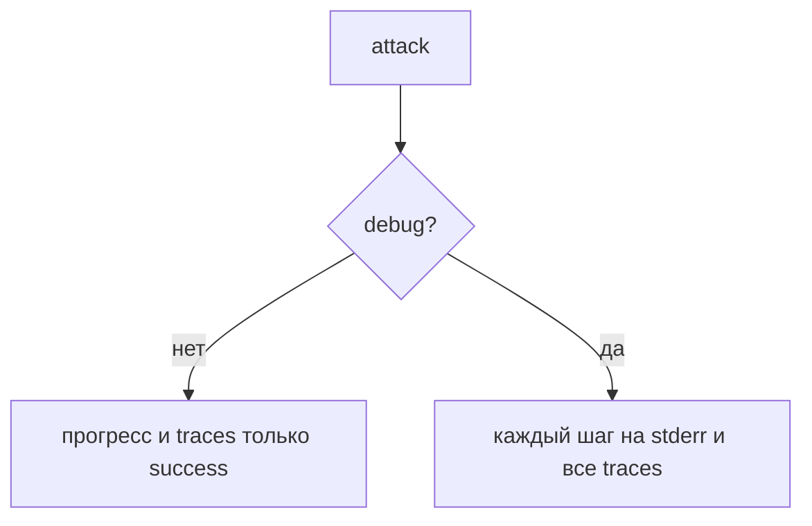

## Why

Обычный прогон прячет детали: JSON только для успешных попыток, в консоли — имя последнего шага. Когда планировщик пишет новый payload или атака падает, не видно запрос `adapt`, факты finalize и ответ стенда. Нужен необязательный debug-режим для разбора таких прогонов.

## What Changes

- Флаг `--debug` и переменная `RED_ALERT_DEBUG`.
- В debug на stderr печатается каждый шаг: имя, актор, URL, статус, тела запроса и ответа.
- В JSON `traces` попадают все попытки, не только успешные.
- Секреты по-прежнему маскируются.
- Без флага поведение не меняется.

Не входит в этот change:

- уровни логирования кроме on/off;
- запись debug в отдельный файл;
- LLM-as-a-judge.

## Capabilities

### New Capabilities

Нет.

### Modified Capabilities

- `attack-cli`: запуск с `--debug` или `RED_ALERT_DEBUG`.
- `attack-report`: в debug полные шаги всех попыток в консоли и в JSON.

## Impact

Меняются CLI, конфиг, печать шагов и сборка JSON. Прогресс-бар в debug выключается: иначе мешает полному логу. Автотесты на mock HTTP.

