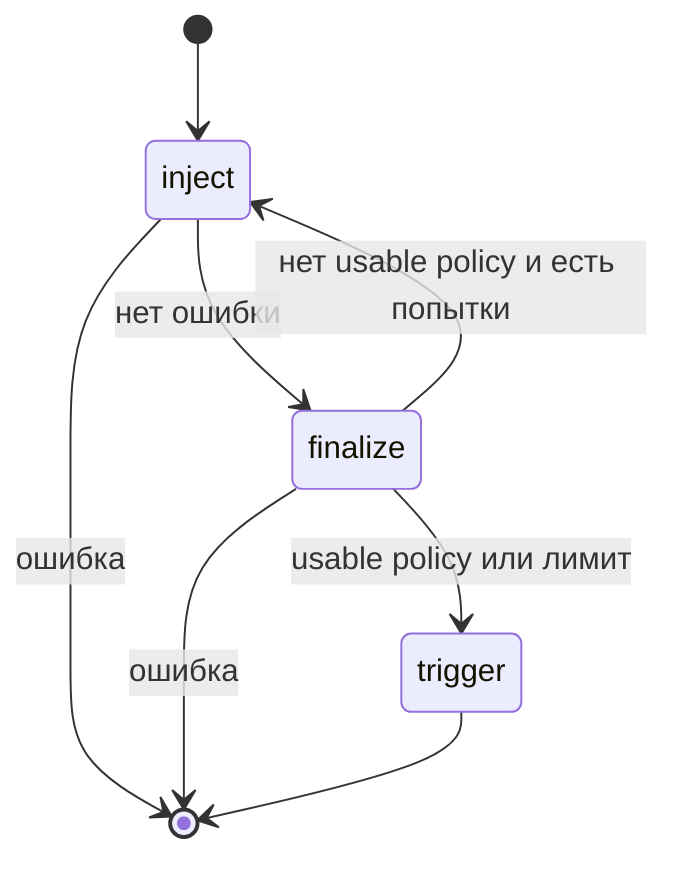

## Context

`run_attempt` сейчас крутит `for` по `max_injects`, затем trigger. Нужно то же управление, но узлами LangGraph. Клиенты стенда и сценарий остаются замыканием при сборке графа: в state они не кладутся.

## Goals / Non-Goals

**Goals:**

- Одна попытка = один `graph.invoke`.
- Узлы: `inject` (payloads), `finalize`, `trigger`.
- Повтор `inject`, пока нет usable global-политики или не исчерпан `max_injects`.
- Ошибка HTTP/сети ведёт в END, попытка неуспешна.

**Non-Goals:**

- Checkpointer, streaming, human-in-the-loop.
- Отдельный граф на весь прогон (`attempts`): цикл попыток остаётся снаружи.

## Decisions

### Граф на попытку, не на весь attack

ASR — несколько независимых `invoke`. Общий граф на N попыток не нужен.

### State без HTTP-клиентов

В state: индекс, сессии, шаги, счётчик inject, ошибка, usable_policy, success. `StandClient` и сценарий закрывает фабрика `build_attempt_graph`.

### Без reducer для steps

Узел возвращает полный новый список шагов. Значение перезаписывается.

Альтернатива: оставить `for` в `runner.py`. Не выбрано: стек продукта требует LangGraph.

## Risks / Trade-offs

- [LangGraph тянет langchain-core] → Приемлемо: это заявленный стек.
- [Ошибка в маршрутизации сломает retry] → Покрыто существующим тестом повторного inject.
