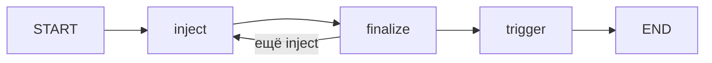

## Why

В продукте оркестрация атаки заявлена как LangGraph, а попытка сейчас — цикл функций. Нужно вести цепочку inject → finalize → trigger графом, чтобы стек совпадал с описанием и дальше было куда добавлять ветвления.

## What Changes

- Добавить зависимость `langgraph`.
- Выполнять одну попытку `memory-poisoning` как StateGraph: узлы inject, finalize, trigger.
- Сохранить внешнее поведение: те же HTTP-шаги, повтор inject, обрыв при ошибке, regex на ответ жертвы.
- Обновить ARCHITECTURE.md.

Не входит в этот change:

- адаптивное планирование и новые сценарии;
- checkpoint, визуальный studio, асинхронный граф;
- смена payload, триггера или критерия успеха.

## Capabilities

### New Capabilities

- `attack-graph`: попытка атаки оркестрируется LangGraph.

### Modified Capabilities

- `memory-poisoning`: цепочка шагов идёт через граф, контракт HTTP и вердикта не меняется.

## Impact

Появляется runtime-зависимость `langgraph`. CLI и отчёт те же. Автотесты остаются на mock HTTP.

