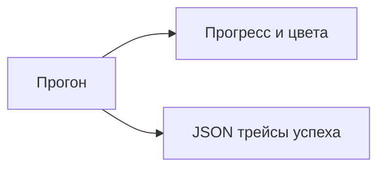

## Why

Сейчас CLI печатает плоский дамп всех шагов без цвета и прогресса. Во время длинного прогона не видно, на каком шаге атака. Трейсы удобнее разбирать как JSON, а на экране нужен короткий ход выполнения.

## What Changes

- Во время атаки показывать прогресс и цветной статус шагов.
- После прогона печатать краткий цветной итог: ASR и вердикт каждой попытки.
- Трейсы **успешных** попыток отдавать JSON: в `--output` или в stdout, если файл не задан.
- Ключи по-прежнему маскировать и в консоли, и в JSON.

Не входит в этот change:

- HTML-отчёт и LLM-as-a-judge;
- трейсы неуспешных попыток в JSON;
- смена сценария атаки.

## Capabilities

### New Capabilities

Нет.

### Modified Capabilities

- `attack-cli`: прогресс и цветной итог в консоли.
- `attack-report`: артефакт с трейсами успешных атак — JSON.

## Impact

Появляется зависимость `rich`. Тесты, которые ждали полный текстовый дамп в stdout, переезжают на краткий итог и JSON. `--output` пишет JSON в UTF-8.

