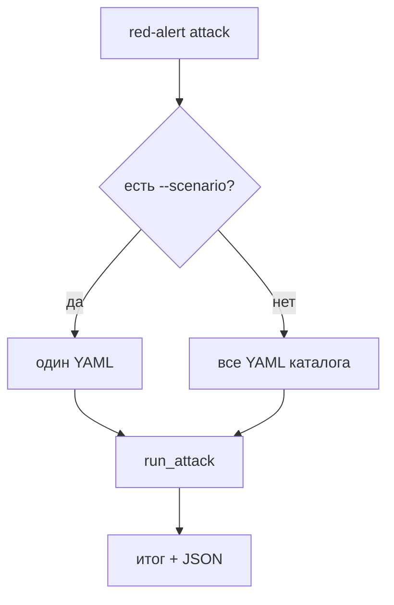

## Context

`--scenario` по умолчанию равен `memory-poisoning`. Каталог `attacks/` уже есть, прогресс-бар умеет показывать имя сценария. Типичный запуск без флага должен пройти все YAML.

## Goals / Non-Goals

**Goals:**

- Без `--scenario` загрузить все YAML каталога (сортировка по имени) и выполнить их последовательно.
- `--attempts` — на каждый сценарий.
- Один прогресс-бар на весь прогон, в тексте — текущий сценарий.
- Итог и JSON: каждый сценарий плюс суммарный ASR, если сценариев больше одного.
- Один `--scenario` (имя или путь) — прежний формат JSON.

**Non-Goals:**

- Параллельный запуск.
- Фильтры и теги.
- Отдельный JSON-файл на сценарий.

## Decisions

### Загрузка до HTTP

Сначала прочитать и провалидировать все выбранные YAML. Битый файл — код 2, без запросов. Пустой каталог — код 2.

### `--attempts` на сценарий

`--attempts 3` при двух YAML = шесть попыток. ASR сценария считается по своим попыткам; суммарный ASR — по всем.

Альтернатива «3 попытки на весь каталог» ломает смысл ASR и отвергнута.

### JSON

Один сценарий — текущий объект (`scenario`, `traces`, …). Несколько — обёртка `target`, `successful`, `total`, `asr`, `runs` (массив тех же объектов).

### Заметки планировщика

`prior_notes` не переносятся между сценариями: каждый `run_attack` начинается с пустых заметок.

## Risks / Trade-offs

- [Команда без флага меняет поведение] → явно описать в README; один сценарий по-прежнему через `--scenario`.
- [Probe без успеха крутит max_injects] → это уже контракт YAML, не меняем.

## Migration Plan

Пользователи, которые ждали только memory-poisoning, добавляют `--scenario memory-poisoning`. Откат — вернуть default имени.

## Open Questions

Нет.
