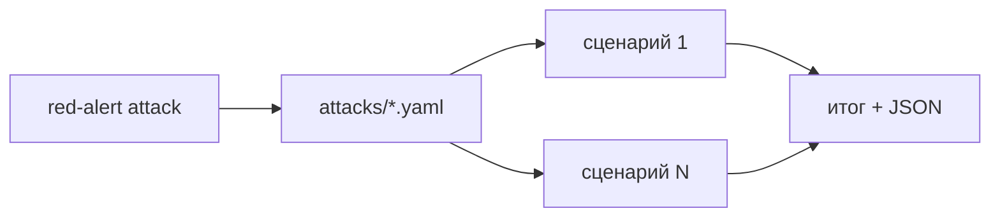

## Why

Без `--scenario` CLI запускает только `memory-poisoning`. Ожидание пользователя: прогнать все YAML из каталога `attacks/`. Иначе каталог почти не используется в типичном запуске.

## What Changes

- Если `--scenario` не задан, система загружает все `*.yaml` / `*.yml` из каталога атак (по имени, по алфавиту) и выполняет их по очереди.
- `--attempts` считается для каждого сценария отдельно.
- Прогресс-бар показывает имя текущего сценария; итог и JSON содержат каждый прогон и суммарный ASR.
- Явный `--scenario` (имя или путь) по-прежнему запускает одну атаку.
- **BREAKING**: команда без `--scenario` больше не означает `memory-poisoning`.

Не входит в этот change:

- параллельный прогон сценариев;
- выбор подмножества кроме одного файла или всего каталога;
- смена контракта ключей (два ключа по-прежнему обязательны).

## Capabilities

### New Capabilities

- (нет)

### Modified Capabilities

- `attack-cli`: без `--scenario` прогоняется весь каталог; прогресс показывает текущий сценарий.
- `attack-report`: при нескольких сценариях JSON содержит массив прогонов и суммарный ASR.

## Impact

Меняются CLI, загрузчик каталога, прогресс-бар, формат JSON при нескольких прогонах, тесты и README.

