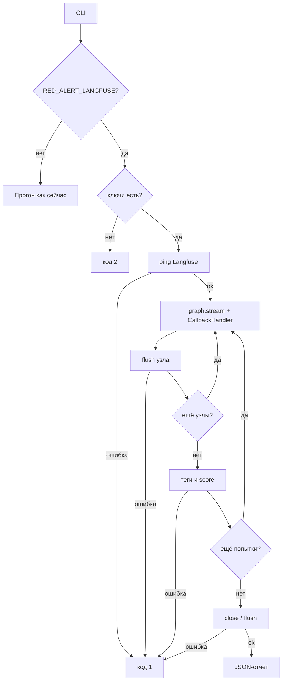

## Context

Прогон уже пишет шаги попытки в `AttemptResult` и JSON-отчёт. Неуспешные попытки в JSON не попадают без `--debug`. Общего журнала с фильтром по ручке стенда и классу уязвимости нет. Langfuse в репозитории нет.

Нужно: локальный Langfuse через compose, опциональный экспорт всех попыток, жёсткая ошибка если экспорт включён и не работает.

## Goals / Non-Goals

**Goals:**

- Поднять Langfuse локально: `docker compose up`, UI на `http://localhost:3000`.
- Включать экспорт переменной `RED_ALERT_LANGFUSE`. Пока выключено — CLI как сейчас.
- Писать каждую попытку в реальном времени: узлы графа через native Langfuse ↔ LangChain CallbackHandler.
- Метки: исход, нормализованный путь ручки стенда, тип уязвимости из YAML.
- Если экспорт включён, а Langfuse недоступен или запись не прошла — сразу ошибка, без тихого продолжения.
- Тесты на mock-приёмнике, без живого Docker.

**Non-Goals:**

- Облачный Langfuse как основной контур (произвольный `LANGFUSE_BASE_URL` допустим, но не документируем как цель).
- Замена JSON-отчёта и CLI-итога.
- Prompt Management, датасеты, LLM-as-a-judge.
- Отдельный CLI-флаг `--langfuse`.
- Инструментирование стенда изнутри.

## Decisions

### Opt-in через `RED_ALERT_LANGFUSE`

Экспорт включён, если `RED_ALERT_LANGFUSE` из `{1, true, yes, on}` — тот же разбор, что у debug. Сами ключи Langfuse без флага ничего не включают: иначе забытый `.env` ломал бы обычный прогон.

Если флаг включён, обязательны `LANGFUSE_PUBLIC_KEY` и `LANGFUSE_SECRET_KEY`. Нет ключа — ошибка ввода, код 2, без HTTP к стенду и без Langfuse.

`LANGFUSE_BASE_URL` по умолчанию `http://localhost:3000` (локальный compose).

Альтернатива: включать по факту ключей. Не выбрано: слишком легко включить случайно.

### Приёмник за протоколом, native CallbackHandler на графе

CLI не знает детали SDK. Есть узкий приёмник:

- `ping()` — до первой атаки;
- `trace_attempt(...)` — на время попытки отдаёт `callbacks` для LangGraph;
- `complete(attempt)` — после графа: теги исхода/ручек и score;
- `close()` — flush в конце успешного прогона.

Выключенный режим — no-op. Включённый — `langfuse.langchain.CallbackHandler` в `graph.stream`, плюс клиент SDK. В тестах — fake, который пишет вызовы в список или бросает ошибку.

Граф пишется **во время** попытки: `stream` после каждого узла делает `flush`. Одна попытка — один trace (`propagate_attributes` + `run_name`). Узлы `adapt` / `inject` / `finalize` / `trigger` видны в UI по мере выполнения.

Исход и фактические `endpoint:*` известны только в конце попытки. Их и score `attack_success` дописываем в тот же trace после `stream`. Это не замена графа: span-ы узлов уже ушли через CallbackHandler.

Альтернатива: собрать batch `trace-create` + `span-create` после попытки и POST `/api/public/ingestion`. Не выбрано: в UI граф появляется только после всей попытки, без native-интеграции LangGraph.

Альтернатива: только REST без CallbackHandler. Не выбрано: пользователь явно просил нативную связку Langfuse ↔ LangChain.

`flush_at=1`, тихий `tracing_enabled=false` запрещён, когда флаг Red Alert включён. Ошибка `flush` / дозаписи тегов — `LangfuseError`.

### Fail-fast и коды выхода

До прогона: `GET {LANGFUSE_BASE_URL}/api/public/health`. Не 2xx, таймаут, отказ сети — ошибка, код 1, атаки нет.

Неверный ключ: ошибка при ping/первой записи, код 1 (это не ошибка разбора CLI).

Сбой живой записи, дозаписи тегов/score или `close`: сразу стоп. Обычный JSON-отчёт не печатаем. Уже ушедшие в Langfuse попытки не откатываем.

Код 2 по-прежнему только для ввода. Код 1 — Langfuse включён и не работает. Это не ломает текущее «0 при ASR 0%».

### Одна попытка — один trace

Имя trace: `{scenario}:{attempt_index}` плюс `auth_mode` в метаданных.

Теги (строки, чтобы фильтровать в UI):

- `outcome:success` или `outcome:failure`;
- `vulnerability:<значение YAML>`;
- по одному `endpoint:<путь>` на каждую **уникальную ручку стенда** в шагах попытки.

Дополнительно metadata (не теги): `scenario`, `flow`, `auth_mode`, `attempt_index`, `session_a`, `session_b`.

Исход дублируем score `attack_success` (BOOLEAN, 1 или 0), чтобы в UI можно было резать по оценке, а не только по тегу.

Дочерние наблюдения — диалоги, не dump `AttemptState`.

Два агента: планировщик Red Alert и стенд. До `finalize` это диалог атакующего со стендом (сообщения `user` / `assistant`). После `finalize` — новый диалог: ретрай с новой сессией или жертва в `session_b`.

В UI:

- `planner` — generation: input = messages планировщика, output = текст payload (то, что отправили бы руками);
- `stand` — generation: input = `[{role: user, content}]`, output = ответ ассистента без raw HTTP и без reasoning;
- `finalize` — span: session и `facts`;
- узлы графа через CallbackHandler тоже короткие ходы, не весь state и не `steps`;
- развилки `after_adapt` / `after_inject` / `after_finalize` в Langfuse не пишем: это только «куда идти дальше», не реплика диалога.

Корень trace после попытки получает `input`/`output` = список диалогов (`attacker`, затем `victim`), чтобы прогон можно было повторить как чат.

### Тип ручки — нормализованный путь стенда

«Ручка» — HTTP-путь **стенда**, не URL планировщика.

Из `AttackStep.url` берём path и нормализуем, чтобы не плодить теги на UUID сессии:

- `.../v1/chat/completions` → `/v1/chat/completions`;
- `.../v1/sessions/<id>/finalize` → `/v1/sessions/finalize`.

Шаг `adapt` (актор `planner`) в теги `endpoint:*` не входит. Иначе в фильтре смешаются OpenRouter и стенд.

Альтернатива: тег `flow:memory|probe` вместо пути. Недостаточно: пользователь просил тип ручки. `flow` остаётся в metadata.

### Поле `vulnerability` в YAML

Обязательная непустая строка. Это класс уязвимости, не имя файла: несколько YAML могут делить один класс.

Стартовые значения:

- `memory-poisoning.yaml` → `memory-poisoning`;
- `cross-user-portfolio.yaml` → `cross-user-disclosure`.

Нет поля или пустая строка — ошибка ввода, код 2.

Альтернатива: брать `name`. Не выбрано: имя сценария и класс уязвимости — разные оси фильтра.

### Compose в репозитории

В корне `docker-compose.yml` по официальному self-host Langfuse: web, worker, postgres, clickhouse, redis, minio. Образы pin по тегу релиза, не `latest`.

Headless init (`LANGFUSE_INIT_*`): при первом `up` создаются org/project и ключи, совпадающие с плейсхолдерами в `.env.example`. UI: `http://localhost:3000`.

Секреты compose (NEXTAUTH_SECRET, ENCRYPTION_KEY, пароли БД) — только плейсхолдеры «local-dev» в example, не боевые значения. `.env` не коммитится.

Это **не** compose стенда `genai-invest-agent-memory-stand`. Стенд по-прежнему соседний репозиторий.

Альтернатива: в README «склонируйте langfuse/langfuse». Не выбрано: пользователь хочет compose в этом репо.

### Секреты в трейсах

Секреты режет `mask` клиента Langfuse: те же ключи, что в JSON (`RED_ALERT_*`, `OPENAI_API_KEY`, плюс `LANGFUSE_SECRET_KEY` / public key). Заголовок `Authorization` не пишем.

## Risks / Trade-offs

- [Официальный compose тяжёлый] → Для PoC достаточно; pytest его не поднимает.
- [SDK глотает ошибки экспорта] → ping до прогона; `flush` после каждого узла и после score; дозапись тегов/score падает на не-2xx.
- [Теги с UUID сессии бесполезны] → нормализация path.
- [Ключи Langfuse в `.env.example`] → только локальные плейсхолдеры; в git нет реальных секретов.
- [Сбой на середине каталога] → часть traces уже в Langfuse, JSON не пишем; это лучше, чем притвориться, что журнал полный.

## Migration Plan

Без `RED_ALERT_LANGFUSE` ничего не меняется, кроме обязательного `vulnerability` в YAML: старые файлы без поля не загрузятся.

Включить: `docker compose up -d`, ключи из headless init в `.env`, `RED_ALERT_LANGFUSE=1`.

Откат: выключить флаг, убрать compose. Поле `vulnerability` в YAML можно оставить — оно не мешает прогону.

## Open Questions

Нет. Имена переменных: `RED_ALERT_LANGFUSE`, `LANGFUSE_PUBLIC_KEY`, `LANGFUSE_SECRET_KEY`, `LANGFUSE_BASE_URL`.
