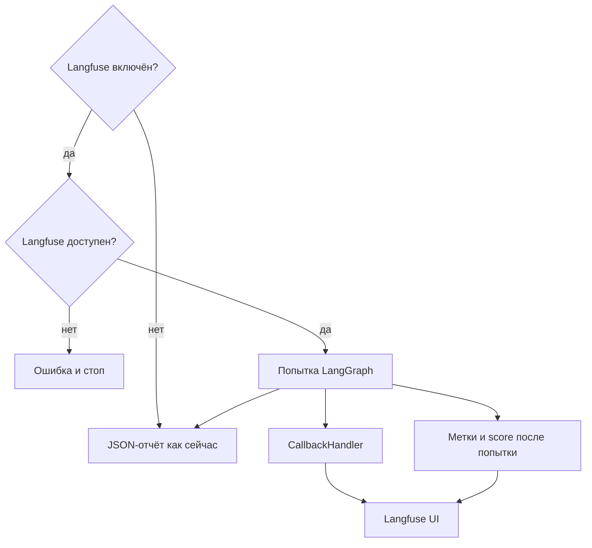

## Why

Трейсы сейчас живут только в локальном JSON: неуспешные попытки туда не попадают без `--debug`, а в UI нельзя отфильтровать прогон по ручке стенда и типу уязвимости. Для разбора ASR нужен общий журнал всех попыток с метками успеха, ручки и класса уязвимости — в локальном Langfuse.

## What Changes

- Поднять Langfuse локально через `docker-compose` в репозитории. Облачный Langfuse не является целевым контуром.
- Включить запись трейсов в Langfuse через конфиг (переменные окружения). Пока не включено — поведение CLI не меняется.
- Если запись включена, писать **каждую** попытку в Langfuse в реальном времени: узлы LangGraph через официальный `CallbackHandler`. JSON-отчёт не заменяет Langfuse и не меняет свои текущие правила.
- Помечать попытку: исход (`success` / `failure`), тип ручки стенда (какой HTTP-эндпоинт ходили), тип уязвимости из YAML.
- Если запись включена, но Langfuse недоступен, ключи неверны или экспорт не удался — сразу ошибка, прогон не продолжается «молча».
- В YAML сценария явно задать тип уязвимости, чтобы метка не зависела только от имени файла.

Не входит в этот change:

- облачный Langfuse SaaS как основной контур;
- замена JSON-отчёта и CLI-итога;
- Prompt Management, датасеты и LLM-as-a-judge в Langfuse;
- UI Red Alert.

## Capabilities

### New Capabilities

- `langfuse-tracing`: локальный Langfuse через compose; живой граф попытки через LangChain CallbackHandler; метки исхода, ручки и типа уязвимости; жёсткая ошибка, если экспорт включён и не работает.

### Modified Capabilities

- `attack-cli`: включение Langfuse из конфига; при включённом экспорте и сбое Langfuse — ненулевой код выхода без тихого продолжения.
- `attack-catalog`: в YAML сценария поле типа уязвимости для меток в Langfuse.

## Impact

Появляются `docker-compose` для Langfuse, переменные хоста и ключей в `.env.example`, зависимости `langfuse` и `langchain`, живая запись графа атаки. Секреты Langfuse в репозиторий не кладутся. Автотесты на mock Langfuse: включено/выключено, метки, ошибка при недоступности.

