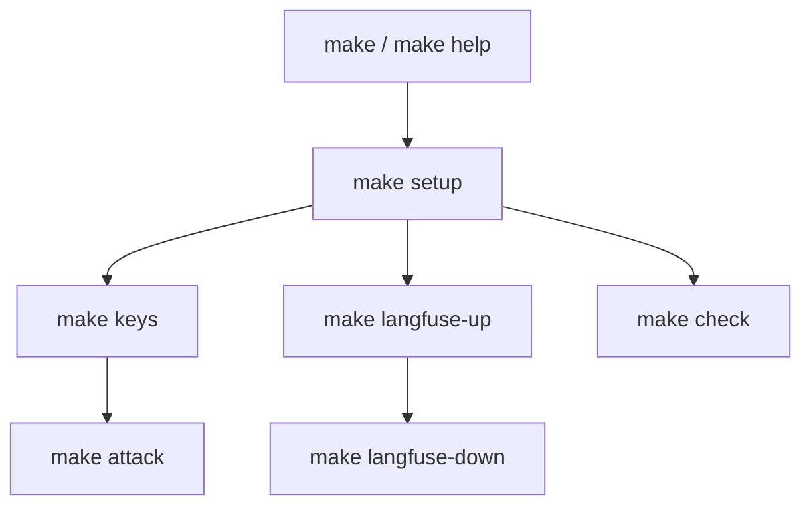

## Context

Локальный контур уже есть: `uv`, `script/fetch_stand_keys.py`, `docker-compose.yml` для Langfuse, `pytest`/`ruff`, `red-alert attack`. Стенд живёт в соседнем репозитории и в этот Makefile не входит.

На машине разработки GNU Make 4.3 вызывает `sh` из Git. Рецепты можно писать в POSIX.

## Goals / Non-Goals

**Goals:**

- Одна команда `make` показывает, что можно сделать.
- Цели покрывают установку среды, ключи стенда, Langfuse, проверки и атаку.
- Рецепты — тонкие обёртки над командами из README.

**Non-Goals:**

- Управление compose инвестиционного стенда.
- `docker compose down -v` и любая очистка данных.
- Новые Python-утилиты.
- just / Task / PowerShell-скрипты вместо Make.

## Decisions

### Короткий список целей

| Цель | Команда |
|---|---|
| `help` | печать списка, цель по умолчанию |
| `setup` | `uv sync --group dev`, `pre-commit install`, скопировать `.env.example` → `.env`, если `.env` нет |
| `keys` | `uv run python script/fetch_stand_keys.py` |
| `langfuse-up` | `docker compose up -d` |
| `langfuse-down` | `docker compose down` без `-v` |
| `test` | `uv run pytest` |
| `lint` | `uv run ruff check .`, затем `uv run ty check` |
| `fmt` | `uv run ruff format .` |
| `check` | `lint` затем `test` |
| `attack` | `uv run red-alert attack $(ARGS)` |

`pre-commit run --all-files` отдельной целью не делаем: хук уже гоняет ruff, ty и pytest.

Альтернатива «одна цель `dev` которая всё поднимает» отвергнута: Langfuse и ключи стенда нужны не всегда.

### POSIX-рецепты, `UV ?= uv`

Рецепты идут через `sh`. `UV` можно переопределить. `ARGS` только у `attack`.

Альтернатива just отвергнута: нужен именно Makefile.

### `.env` только если файла нет

`setup` не перезаписывает существующий `.env`. Ключи стенда обновляет только `keys`.

### Тест не запускает Docker и не гоняет `make test`

Автотест вызывает `make help` и проверяет, что в выводе есть все имена целей. Так нет рекурсии и нет живого compose.

## Risks / Trade-offs

- [На машине без Make цели недоступны] → в README остаются те же сырые команды.
- [Путают Langfuse compose со стендом] → в `help` явно «локальный Langfuse», не стенд.
- [`make keys` ходит в живой стенд] → это и есть смысл цели; в тестах её не выполняем.

## Migration Plan

Старые команды из README остаются рабочими. Откат — удалить `Makefile` и абзац в документации.

## Open Questions

Нет.
