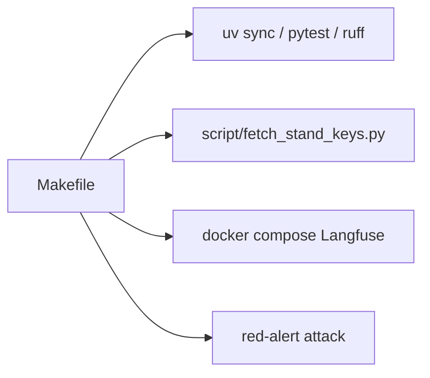

## Why

Повседневные команды размазаны по README: `uv sync`, хуки, ключи стенда, Langfuse, тесты. Легко забыть флаги или перепутать compose Langfuse с compose стенда. Нужна одна точка входа для локальной работы.

## What Changes

- В корне появляется `Makefile` с коротким набором целей: среда uv, выпуск ключей стенда, поднять/опустить Langfuse, проверки, прогон атаки.
- `make` без аргументов печатает список целей.
- Цели только оборачивают уже существующие команды. Новой логики продукта нет.
- README и `ARCHITECTURE.md` указывают на Makefile.

Не входит:

- запуск или остановка инвестиционного стенда (другой репозиторий);
- удаление томов Langfuse (`down -v`);
- новые скрипты, зависимости и подкоманды `red-alert`;
- цели OpenSpec, деплой, очистка `.venv`.

## Capabilities

### New Capabilities

- `dev-makefile`: корневой Makefile с целями локальной разработки.

### Modified Capabilities

- (нет)

## Impact

Добавляются `Makefile`, короткие правки документации и автотест, который проверяет список целей через `make help`. Команда `red-alert attack`, контракт отчёта и runtime-зависимости не меняются.

