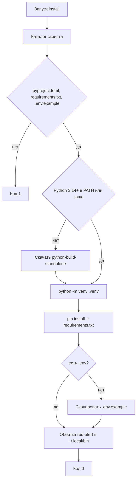

## Context

Пользователь ставит CLI после клона репозитория. Ему нужен Python 3.14+ и зависимости runtime, не `uv` и не инструменты разработки. Разработчики по-прежнему работают через `uv`, `make setup` и pre-commit.

`pre-commit` сейчас в `[project.dependencies]`, поэтому попадает в пользовательский lock. Его место — группа `dev`.

Каталог `attacks/` не входит в wheel: после обычного `pip install .` пакет ищет атаки относительно site-packages и не находит репозиторий. Редактируемая установка (`-e .`) оставляет пакет в клоне.

## Goals / Non-Goals

**Goals:**

- Пользовательская установка через `venv` и `pip`.
- Если Python 3.14+ нет, скрипт сам скачивает portable CPython.
- `requirements.txt` в корне совпадает с runtime-частью `uv.lock`.
- После установки команда `red-alert` доступна в PATH.
- Существующий `.env` не перезаписывается.
- Автотесты не запускают живой `pip install` и не меняют PATH машины CI.

**Non-Goals:**

- `uv` в пользовательских скриптах.
- Dev-группа, pre-commit и хуки в `install.sh` / `install.ps1`.
- PyPI, pipx, brew, winget.
- Замена `Makefile`.

## Decisions

### Два контура: пользователь и разработчик

| Кто | Как |
|---|---|
| Пользователь | `./install.sh` или `.\install.ps1` |
| Разработчик | `make setup` (`uv sync --group dev`, хуки) |

Альтернатива «один скрипт для всех» отвергнута: пользователю не нужен pre-commit.

### `requirements.txt` из lock, без dev

Команда экспорта:

`uv export --frozen --no-dev --no-hashes -o requirements.txt`

`--no-dev` отсекает pytest/ruff/ty. `--frozen` не пересчитывает lock. `--no-hashes` проще для `pip`. В файле есть `-e .`: один `pip install -r requirements.txt` ставит зависимости и сам пакет из клона.

Хук local в `.pre-commit-config.yaml` запускает ту же команду, если меняются `uv.lock` или `pyproject.toml`. Файл коммитится, чтобы пользователь ставил без `uv`.

Альтернатива «пользователь ставит из `pyproject.toml` без lock» отвергнута: версии разъедутся.

### `pre-commit` только в группе `dev`

Пакет больше не тянет хуки как runtime. `make setup` по-прежнему ставит их через `uv sync --group dev`.

### venv в клоне, команда в `~/.local/bin`

Скрипт создаёт `.venv` в корне репозитория, если его нет, и ставит туда пакет через `python -m pip`.

На PATH попадает не весь venv, а одна команда:

- POSIX: симлинк `$HOME/.local/bin/red-alert` → `$ROOT/.venv/bin/red-alert`; каталог дописывается в `~/.profile` и при необходимости в `~/.zprofile`, если `.local/bin` там ещё нет.
- Windows: `red-alert.cmd` в `%USERPROFILE%\.local\bin`, каталог добавляется в User PATH.

Так не засоряем системный Python и не требуем `uv`.

Альтернатива `pip install --user` отвергнута: на дистрибутивах с PEP 668 установка в user site часто ломается.

### Portable CPython, если системного нет

Если в PATH нет Python 3.14+, скрипт берёт уже скачанный интерпретатор из пользовательского кэша или качает pinned сборку [python-build-standalone](https://github.com/astral-sh/python-build-standalone): релиз `20260901`, CPython `3.14.7`, архив `install_only_stripped`.

Кэш: `$XDG_DATA_HOME/red-alert/python-3.14.7` или `~/.local/share/red-alert/python-3.14.7` на POSIX, `%LOCALAPPDATA%\red-alert\python-3.14.7` на Windows.

Поддерживаемые цели: Linux gnu/musl на x86_64 и aarch64, macOS x86_64 и arm64, Windows x64 и arm64. Иная платформа — код 1 и сообщение, без попытки угадать.

`uv` для этого не используем: это пользовательский контур, нужен только интерпретатор для `venv` и `pip`.

Если `.venv` уже есть, но его Python старше 3.14, каталог удаляем и создаём заново.

Альтернатива «официальный installer python.org» отвергнута: на Linux нет одного бинарника, на macOS часто нужен sudo.

### Тесты читают файлы

Проверяем тексты скриптов, хука и наличие `requirements.txt`. Не вызываем живой pip и не пишем в домашний PATH.

## Risks / Trade-offs

- [Симлинк/обёртка указывает на конкретный клон] → повторный запуск install из нового клона обновляет обёртку.
- [После установки нужна новая сессия, чтобы подхватить PATH] → скрипт добавляет каталог в текущий PATH и пишет его в профиль.
- [Хук экспорта требует `uv` у разработчика] → это контур `make setup`, не пользовательский.
- [Pinned URL python-build-standalone устареет] → меняем константы релиза в двух скриптах; автотест проверяет, что версия и хост совпадают.
- [Скачивание требует сеть и GitHub] → если Python 3.14+ уже есть, сеть не нужна.

## Migration Plan

`make setup` не меняется по смыслу. Откат — вернуть старые скрипты, удалить хук и `requirements.txt`, вернуть `pre-commit` в runtime.

## Open Questions

Нет.
