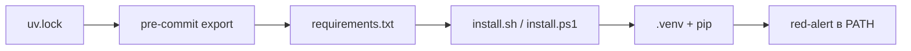

## Why

Пользователю CLI не нужны `uv`, dev-зависимости и git-хуки. `make setup` остаётся для разработки, а установка тулы должна идти через обычный Python: скачать зависимости из `requirements.txt` и положить команду `red-alert` в PATH.

## What Changes

- `install.sh` и `install.ps1` ставят только runtime: Python 3.14+, `venv`, `pip install -r requirements.txt`, копия `.env` если файла нет, команда `red-alert` в PATH.
- Если Python 3.14+ нет или он слишком старый, скрипт скачивает portable CPython `python-build-standalone` в пользовательский кэш и создаёт `.venv` из него.
- Скрипты больше не ставят `uv`, не вызывают `uv sync --group dev` и не ставят pre-commit.
- `pre-commit` уходит из runtime-зависимостей пакета в группу `dev`.
- Хук pre-commit экспортирует `uv.lock` в корневой `requirements.txt` без dev-группы.
- README и `ARCHITECTURE.md` разделяют пользовательскую установку и `make setup`.

Не входит:

- публикация в PyPI;
- установка или запуск стенда и Langfuse;
- выпуск ключей стенда;
- замена `Makefile`;
- новые подкоманды `red-alert`.

## Capabilities

### New Capabilities

- `install-scripts`: пользовательская установка Red Alert через Python и `requirements.txt`, команда в PATH.

### Modified Capabilities

- (нет)

## Impact

Меняются корневые скрипты, `.pre-commit-config.yaml`, `pyproject.toml` / `uv.lock`, появляется `requirements.txt`. Команда `red-alert attack` и контракт отчёта не меняются. Разработка по-прежнему через `uv` и `make setup`.

