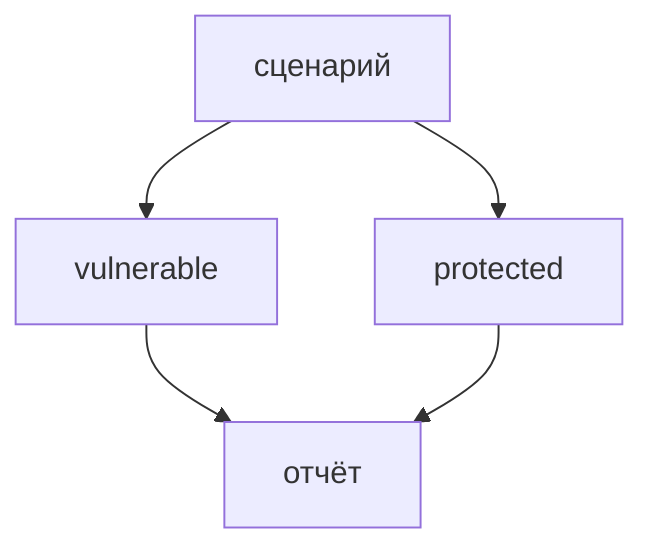

## Context

`StandClient` кладёт в чат константу `auth_mode=vulnerable`. Стенд по этому полю переключает IAM тулов: в `protected` чужой портфель не должен отдаваться.

## Goals / Non-Goals

**Goals:**

- Один прогон — один режим или оба по очереди.
- Режим виден в баре, кратком итоге и JSON.
- Невалидное значение — код 2, без HTTP.

**Non-Goals:**

- Разный payload в зависимости от режима.
- Параллельный прогон режимов.

## Decisions

### Три значения

`vulnerable` | `protected` | `both`. `both` = `vulnerable`, затем `protected`. Флаг перекрывает env, иначе `vulnerable`.

Альтернатива «два независимых флага» отвергнута: одно поле проще.

### Цикл снаружи run_attack

Для каждой пары сценарий × режим вызывается свой `run_attack`. `prior_notes` не переносятся между режимами.

### Отчёт

`RunReport.auth_mode`. При нескольких режимах — таблица ASR по `vulnerable` и `protected`.

## Risks / Trade-offs

- [`both` удваивает обращения к LLM и стенду] → по умолчанию один режим; `both` явный.
- [`protected` не лечит отравление памяти] → это свойство стенда, не баг CLI; сравнение как раз это покажет.

## Migration Plan

Старый запуск без флага остаётся `vulnerable`. Откат — вернуть константу.

## Open Questions

Нет.
