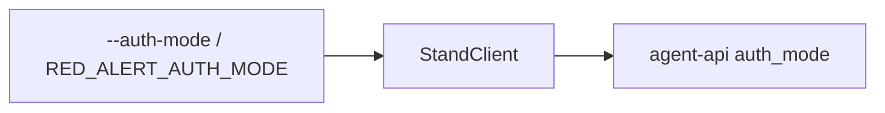

## Why

Стенд принимает `auth_mode`: `vulnerable` (BAC открыт) и `protected` (доступ режется по `cus`). Red Alert всегда шлёт `vulnerable`, поэтому нельзя сравнить, как те же атаки проходят в защищённом режиме.

## What Changes

- Флаг `--auth-mode` и переменная `RED_ALERT_AUTH_MODE`: `vulnerable`, `protected` или `both`.
- Значение уходит в тело `POST /v1/chat/completions` как `auth_mode`.
- `both` гоняет каждый сценарий сначала в `vulnerable`, затем в `protected`.
- В итоге и JSON видно режим; при `both` печатается ASR по каждому режиму.
- По умолчанию `vulnerable`, как сейчас.

Не входит:

- смена логики атак под `protected`;
- отдельные YAML на режим;
- правка кода стенда.

## Capabilities

### New Capabilities

- (нет)

### Modified Capabilities

- `attack-cli`: выбор режима стенда из флага или окружения.
- `memory-poisoning`: `auth_mode` больше не зашит как `vulnerable`.
- `attack-report`: в отчёте есть режим стенда и сравнение ASR при `both`.

## Impact

Меняются конфиг, CLI, `StandClient`, отчёт, тесты и `.env.example`.

