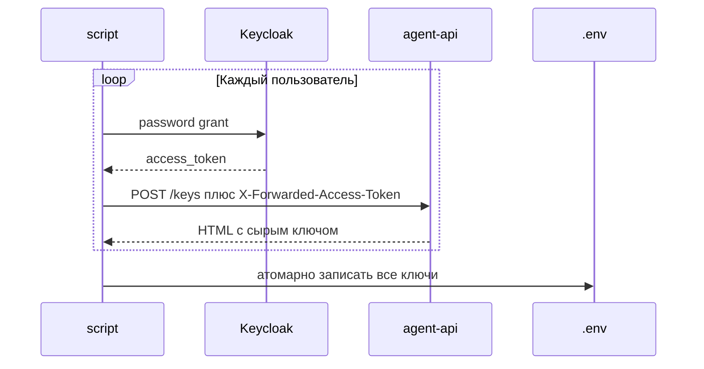

## Context

`red-alert attack` уже читает `RED_ALERT_API_KEY` и `RED_ALERT_VICTIM_API_KEY` из `.env`. Сырые ключи стенд показывает один раз на HTML-странице «Мой аккаунт» после SSO. После пересоздания Mongo их нет, и специалист снова логинится вручную за каждого тестового клиента.

Стенд уже умеет скриптовый вход: Keycloak Direct Access Grant для клиента `streamlit-ui` и `POST /keys` на `agent-api`, если в запросе есть `X-Forwarded-Access-Token`. Браузер и oauth2-proxy для этого не нужны.

## Goals / Non-Goals

**Goals:**

- Один запуск скрипта выпускает ключи выбранных пользователей и кладёт их в `.env`.
- Атакующий и жертва сразу пригодны для текущего `red-alert attack`.
- Дополнительные пользователи сохраняются отдельно — без смены логики атак.
- URL, реалм и список пользователей настраиваются, чтобы не пришивать `localhost`.

**Non-Goals:**

- Прогон сценариев на N пользователях.
- Подкоманда `red-alert`.
- Браузер, Playwright, клики по UI.
- Правка стенда и JSON-контракт выдачи ключей.
- Отзыв старых ключей.
- Другой протокол авторизации, не Keycloak + `POST /keys`.

## Decisions

### Скрипт в `script/`, не в пакете CLI

Точка входа: `script/fetch_stand_keys.py`. Подготовка стенда живёт отдельно от `red_alert`, чтобы ядро не знало про Keycloak.

Альтернатива «`red-alert setup-keys`» отвергнута: это втащило бы контракт одного стенда в публичный CLI.

### Password grant, затем `POST /keys`

Альтернатива «ходить на `:8501` через oauth2-proxy» отвергнута: нужны cookie и редиректы. Альтернатива «менять стенд под JSON» вне объёма.

Ключ вынимается из HTML по префиксу `sk-genai-`. Если разметки нет — ошибка, `.env` не трогаем.

### Список пользователей и имена переменных

По умолчанию `client1001,client1002`. Первый → `RED_ALERT_API_KEY`, второй → `RED_ALERT_VICTIM_API_KEY`. Остальные → `RED_ALERT_USER_<username>_API_KEY`. Меньше двух имён — код 2.

Пароль по умолчанию равен логину (как в стенде). Общий пароль задаётся флагом или `RED_ALERT_STAND_PASSWORD`.

### Upsert `.env`

Пишем только после успешного выпуска всех ключей. Если файла нет, а есть `.env.example` рядом — копируем пример и обновляем ключи. Иначе создаём новый файл. Уже существующие чужие строки и комментарии не удаляем: совпавшую переменную заменяем на месте, новую дописываем в конец.

### Параметры подключения

| Параметр | Флаг | Переменная | Умолчание |
|---|---|---|---|
| agent-api | `--target` | `RED_ALERT_TARGET` | `http://localhost:8600` |
| Keycloak | `--keycloak-url` | `RED_ALERT_KEYCLOAK_URL` | `http://localhost:8180` |
| realm | `--realm` | `RED_ALERT_KEYCLOAK_REALM` | `genai-stand` |
| client id | `--client-id` | `RED_ALERT_KEYCLOAK_CLIENT_ID` | `streamlit-ui` |
| client secret | `--client-secret` | `RED_ALERT_KEYCLOAK_CLIENT_SECRET` | `streamlit-ui-secret` |
| пользователи | `--users` | `RED_ALERT_STAND_USERS` | `client1001,client1002` |
| общий пароль | `--password` | `RED_ALERT_STAND_PASSWORD` | логин пользователя |
| файл | `--env-file` | — | `.env` в текущей директории |

Флаг перекрывает переменную. HTTP Keycloak `:8180` выбран специально: не упираемся в самоподписанный TLS `:8443`.

### Секреты и коды выхода

В stdout/stderr нет сырых ключей, паролей и client secret. Печатаем логины и префикс ключа. Код `0` — все ключи записаны; `1` — сбой Keycloak, стенда или разбора HTML, `.env` без изменений; `2` — ошибка ввода, без HTTP.

Тесты — только `httpx.MockTransport`. Живой стенд в CI не нужен.

## Risks / Trade-offs

- [Стенд сменит HTML страницы ключей] → скрипт падает с кодом 1 и не портит `.env`; правка — один разборщик.
- [Демо-секрет `streamlit-ui` в `.env.example`] → это уже публичный секрет учебного стенда, не боевой. В комментарии явно указать, что значение только для локального стенда.
- [Каждый запуск плодит новый ключ на стенде] → старые не отзываем (YAGNI); в `.env` остаётся только свежий.
- [Частичная запись при сбое второго пользователя] → запись только после полного успеха.

## Migration Plan

Старый ручной ввод ключей остаётся рабочим. Откат — удалить `script/` и строки подготовки в документации.

## Open Questions

Нет.
