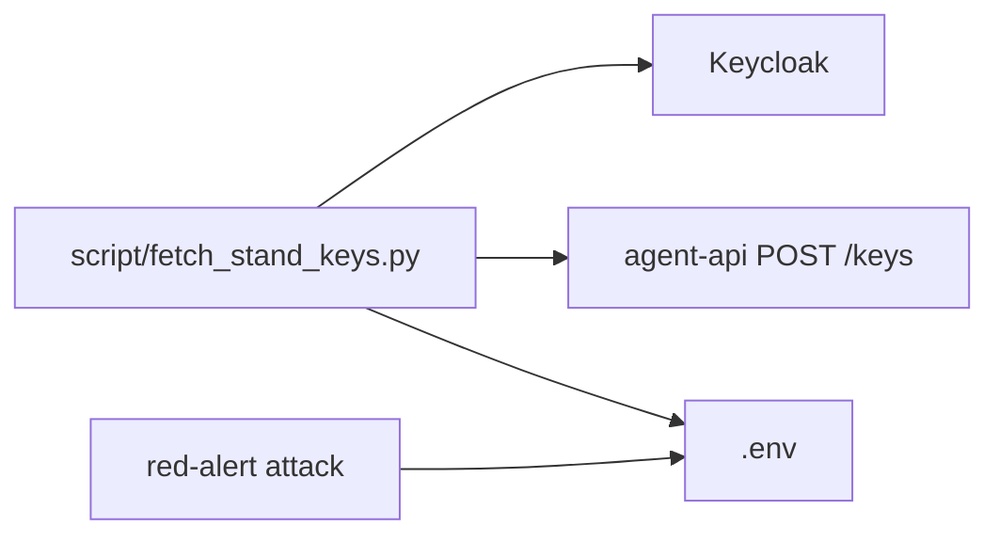

## Why

После переподнятия тестового стенда долгоживущие API-ключи пропадают: их снова нужно получать вручную через SSO и страницу «Мой аккаунт». Это тормозит прогоны и мешает заранее завести ключи сразу нескольких тестовых пользователей.

## What Changes

- Появляется каталог `script/` с утилитой подготовки стенда: логин тестовых пользователей, выпуск ключей, запись в локальный `.env`.
- Скрипт не встраивается в `red-alert attack`: ядро CLI по-прежнему только читает уже готовые ключи. Так подготовка остаётся стендо-зависимой, а прогон атак — нет.
- По умолчанию выпускаются ключи атакующего и жертвы (`client1001` / `client1002`) и пишутся в `RED_ALERT_API_KEY` / `RED_ALERT_VICTIM_API_KEY`. Можно запросить дополнительных пользователей — их ключи сохраняются отдельными переменными.
- Существующие несвязанные переменные в `.env` (ключ планировщика, Langfuse и т.п.) не затираются.
- URL стенда, Keycloak и список пользователей задаются флагами или переменными, чтобы тот же скрипт работал с другим адресом/портом того же протокола.

Не входит в этот change:

- прогон атак сразу на нескольких пользователях;
- новые подкоманды `red-alert`;
- браузерный SSO и ручной клик по странице аккаунта;
- изменение кода стенда или новые JSON-ручки выдачи ключей;
- адаптеры других стендов с другим протоколом авторизации;
- отзыв старых ключей на стенде.

## Capabilities

### New Capabilities

- `stand-env-setup`: скрипт авторизации на стенде, выпуска ключей тестовых пользователей и безопасной записи их в `.env`.

### Modified Capabilities

- (нет)

## Impact

Добавляются `script/`, автотесты на mock HTTP, строки в `.env.example` и короткие правки `README` / `ARCHITECTURE.md`. Новых runtime-зависимостей нет: используется уже существующий `httpx`. Команда `red-alert attack` и контракт JSON-отчёта не меняются. Живой стенд в CI не нужен. Секреты по-прежнему не коммитятся (`.env` в `.gitignore`).

