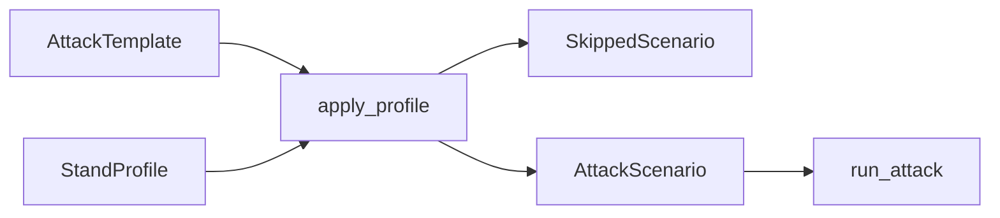

## Context

Каталог атак — готовые YAML под инвест-стенд (YDEX, CUS, картинки). CLI без `--scenario` гоняет все файлы. Исходники стенда Red Alert не читает. Кейс требует шаг «анализ приложения», а типовой прогон — неизвестный репозиторий.

Ограничения: Python 3.14+, без новых обязательных runtime-зависимостей, тесты на фикстурах без живого стенда и без живого харнеса. Планировщик и судья уже ходят в OpenAI-совместимый API.

## Goals / Non-Goals

**Goals:**

- Шаблоны техник с `requires` и слотами; стендовый смысл — в StandProfile.
- `inspect` пишет профиль из исходников, без HTTP стенда.
- `attack` собирает экземпляры, отсекает только заведомо неприменимое, считает ASR по ran.
- Упакованный `invest-stand` сохраняет текущее демо.
- Анализатор за протоколом: фейк в тестах, эвристика, LLM, один харнес.

**Non-Goals:**

- Генерация новых техник вне каталога.
- Донастройка payload во время прогона.
- Три реализации харнеса.
- Inspect живого API.
- Сырые исходники в планировщик и судью.

## Decisions

### Шаблон + профиль, не правка каталога на лету

`attacks/*.yaml` — `AttackTemplate`: текущие поля сценария плюс `requires` и `slots`. Плейсхолдеры `{{slot}}` в текстовых полях. `usable_policy` может содержать плейсхолдеры в списках строк.

`profiles/invest-stand.yaml` — упакованный профиль. `--profile` / `RED_ALERT_PROFILE` перекрывают его.

Сборка: capability `absent`+`high` → skip; пустой слот → skip; иначе подстановка и валидация как у нынешнего `AttackScenario`.

Альтернатива: хранить в каталоге готовые экземпляры и только список `disabled`. Не выбрана: неизвестный репозиторий всё равно получит YDEX в payload.

### Известные capability — закрытый список

`persistent_memory`, `multi_user`, `vision`. Этого достаточно, чтобы отсечь memory / cross-user / image. Нет поля — `unknown`/`low`, шаблон не режем.

`--scenario` обходит только capability. Пустой слот по-прежнему ошибка.

### inspect не ходит на стенд

`red-alert inspect <path> [--output] [--analyzer]`. Ключи стенда не нужны. По умолчанию пишет `stand-profile.yaml` в cwd.

Протокол: `SourceAnalyzer.analyze(path) -> StandProfile`.

Backend:

| id | Когда | Сеть |
|---|---|---|
| `heuristic` | всегда есть; default без ключа | нет |
| `llm` | default при `OPENAI_API_KEY` и `MODEL_ATTACK` | тот же API, что планировщик |
| `harness` | явный `--analyzer harness` | Codex CLI |

Живой харнес — **Codex** (`codex exec`): один бинарь, Windows, JSON/YAML в stdout. OpenCode и pi в этом change не подключаем.

Альтернатива: только харнес. Не выбрана: без установленного Codex `inspect` нельзя потрогать. Эвристика и LLM дают прогон на машине с уже существующим `.env`.

Альтернатива: свой краулер без LLM. Не выбрана как единственный путь: на неизвестном репо bindings будут пустые и почти всё отсечется.

### Исходники во внешнюю модель — только явный inspect

`attack` исходники не читает. `inspect --analyzer llm|harness` сам является согласием отправить выбранные файлы. Не читаем `.env`, `.git`, `node_modules`, `.venv`, `__pycache__`, бинарники. В профиль не попадают секреты из этих путей.

`heuristic` и фейк сеть не используют.

### Эвристика и LLM заполняют и capability, и слоты

Эвристика: по дереву и тексту файлов (память / persist / finalize, несколько пользователей, image/vision). Bindings заполняет только если находит явные якоря (иначе пусто → skip при attack). Для неизвестного репо это честно.

LLM: дерево файлов + короткие выдержки из манифестов и кода, ответ — JSON по схеме профиля, валидация Pydantic.

Харнес и LLM получают краткий каталог шаблонов и должны заполнить слоты по коду, а не только capability. Пустые bindings — только если в исходниках нечего привязать.

Харнес: `codex exec --sandbox read-only --output-schema --output-last-message`; если last-message пуст — вытащить JSON из stdout.

### Отчёт

`SkippedScenario(name, reason)` печатается в консоли. JSON: массив `skipped`. `total` / ASR — только попытки `run_attack`. Все шаблоны skipped → код 2, без JSON-отчёта.

Один `--scenario` без skip: как сейчас, `skipped` пустой или отсутствует.

### Тесты

Фейк-анализатор и фикстурные профили. Живой Codex и живой LLM в CI не вызываются. `invest-stand` + шаблоны должны собрать те же смыслы, что проверяют нынешние `test_attacks`.

## Risks / Trade-offs

- [Харнес врёт в bindings] → skip при пустом слоте; `invest-stand` для демо; эвристика не выдумывает слоты.
- [Исходники уходят во внешний API] → только `inspect` + `llm`/`harness`; исключить секреты и мусорные каталоги.
- [BREAKING: каталог больше не экземпляры] → default-профиль `invest-stand`; явный путь к YAML без слотов по-прежнему гоняется.
- [Эвристика слабо заполняет неизвестный репо] → LLM/харнес для слотов; capability-отсечение всё равно экономит прогоны.

## Migration Plan

1. Добавить модели профиля и шаблона, упаковать `invest-stand`.
2. Перевести YAML каталога на слоты, не ломая сборку через default-профиль.
3. `attack --profile`, skip, отчёт.
4. `inspect` и анализаторы.
5. Документация. Откат: вернуть прежние YAML и загрузку без профиля.

## Open Questions

Нет. Харнес — Codex. Исходники во внешнюю модель — только по команде `inspect` с `llm` или `harness`.
