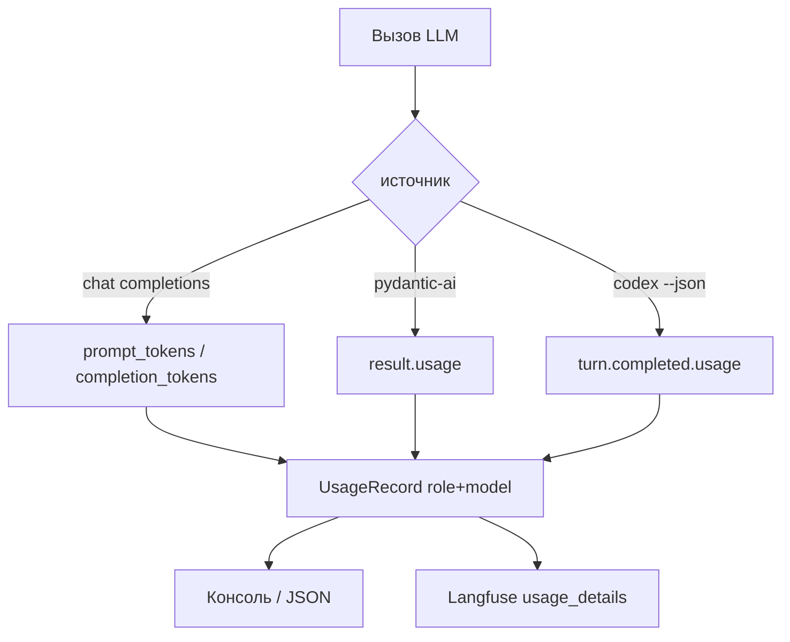

## Context

Планировщик и судья уже ходят в разные OpenAI-совместимые URL и модели. Inspect пишет профиль через `heuristic`, `llm` (тот же контур, что планировщик) или `harness` (Codex CLI). Default inspect сейчас: `llm`, если есть ключ и `MODEL_ATTACK`, иначе `heuristic`.

Ответы chat completions и Codex уже содержат usage, но код его выбрасывает. Судья идёт через pydantic-ai; сырого HTTP в шаге нет. Langfuse пишет planner как generation, судью — только как узел графа, без токенов. Стенд — чужая модель, в этот change не входит.

Ограничения: Python 3.14+, без новых зависимостей, CI без живого Codex/vLLM/OpenRouter. Провайдер атаки может быть OpenRouter или свой vLLM с тем же `/chat/completions`.

## Goals / Non-Goals

**Goals:**

- Запись input/output токенов с ролью и моделью: `inspect`, `planner`, `judge`.
- Один разбор OpenAI `usage` для OpenRouter и vLLM.
- Default inspect — Codex; нет бинаря — код 1 и подсказка про `--analyzer llm|heuristic`.
- Usage в консоли inspect, в консоли и JSON attack.
- Usage планировщика и судьи в Langfuse generation.

**Non-Goals:**

- Стоимость в валюте и прайс-лист.
- Токены стенда.
- Общий total inspect+attack.
- Локальный токенизатор, если usage нет.
- Langfuse для inspect.

## Decisions

### Роль + модель, не доллары

Одна запись вызова: `role`, `model`, `input_tokens`, `output_tokens`, `calls`. Цена не считается: вход и выход хранятся отдельно, чтобы потом считать руками.

Роль обязательна: `inspect --analyzer llm` и planner могут делить `MODEL_ATTACK`. Модель обязательна: `MODEL_JUDGE` и модель Codex отличаются от планировщика.

Альтернатива: только модель. Не выбрана — смешаются inspect-llm и planner.

Альтернатива: считать USD из `usage.cost` OpenRouter. Не выбрана: у vLLM этого поля нет, решение должно быть общим.

### Один парсер OpenAI-совместимого usage

Читать только стандартные поля `usage.prompt_tokens` и `usage.completion_tokens`. OpenRouter-only поля (`cost`, `cost_details`) игнорировать. Так один путь покрывает OpenRouter и vLLM.

Если `usage` нет — роль и модель всё равно пишутся, токены этой записи равны 0 (провайдер не сообщил, числа не угадываем).

Ретраи планировщика (до 3) и судьи (`retries=2`) суммируются внутри `plan()` / `judge()`, не из финального `AttackStep`.

Судья: `result.usage()` pydantic-ai (те же prompt/completion). Тесты без сети подставляют usage в mock-результат.

### Codex: `--json` + last-message

`codex exec` получает `--json`. Профиль по-прежнему из `--output-last-message`. stdout — JSONL: сумма `input_tokens` / `output_tokens` из всех `turn.completed`; reasoning output кладём во выход, cached input — во вход (как отдаёт Codex в этих полях). Модель — из события, где она есть, иначе `codex`.

Альтернатива: парсить session-файлы `~/.codex`. Не выбрана: лишняя зависимость от домашней директории.

### Default inspect — harness

Без `--analyzer` всегда `harness`. Нет `codex` в PATH — код 1, текст ошибки содержит подсказку `--analyzer llm` или `--analyzer heuristic`. Тихого fallback нет.

`llm` остаётся анализатором по флагу и тем же OpenAI-парсером, роль `inspect`.

Heuristic: usage можно не печатать или напечатать нули; профиль пишется как сейчас.

### Отчёт: inspect отдельно, attack отдельно

Inspect: после пути профиля строка `inspect · <model> · in=… out=…`. В StandProfile usage не кладём.

Attack: в кратком итоге и в JSON поле `usage` с разбивкой по ролям `planner` и `judge` (модель, input, output). Несколько моделей на одну роль — список записей, не схлопывать.

`script/sum_attack_usage.py` читает один или несколько JSON-отчётов, берёт корневой `usage` (чтобы не сложить его ещё раз с `runs`), печатает строки ролей и итог `in` / `out`. Стоимость не считает. Inspect-отчётов нет — только attack JSON.

### Langfuse только attack

`DialogueTurn` получает `input_tokens` / `output_tokens`. `LangfuseDialogue.planner` при `update` передаёт `usage_details` (`input`, `output`) и модель.

Для судьи добавляется generation `judge` по тому же шаблону, что planner. Стенд generation usage не получает.

Выключенный Langfuse — поведение как сейчас, usage остаётся в JSON/консоли.

## Risks / Trade-offs

- [vLLM без usage] → запись с нулями, без угадывания; в README кратко, что нужен стандартный `usage`.
- [Codex JSONL ломает разбор профиля] → профиль только из last-message; JSON в stdout не считать профилем, если включён `--json`.
- [BREAKING default inspect] → README и help; без Codex явный `--analyzer`.
- [Судья без сырого HTTP] → usage из pydantic-ai; в тестах mock `usage()`.

## Migration Plan

1. Модель `UsageRecord` / агрегат и парсер OpenAI usage.
2. Планировщик и судья копят usage; CLI и JSON печатают блок.
3. Codex `--json` + default harness + сообщение об отсутствии CLI.
4. Langfuse `usage_details` на planner/judge.
5. Скрипт суммы токенов по JSON-отчётам. Документация. Откат: вернуть default inspect и не читать usage.

## Open Questions

Нет. Стоимость не считаем. Стенд не считаем. Нет Codex — код 1 и подсказка про llm/heuristic.
