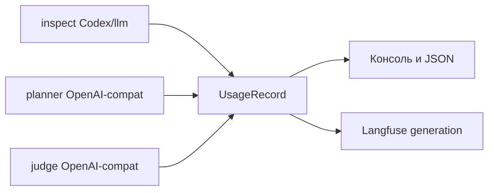

## Why

Прогон и inspect жгут разные модели (Codex, планировщик, судья) с разной ценой входа и выхода, но Red Alert usage не записывает. Нельзя понять, сколько токенов ушло на анализ исходников и сколько — на атаку, независимо от того, LLM сидит на OpenRouter или на своём vLLM.

## What Changes

- Собирать **входные и выходные токены** каждого вызова Red Alert LLM и привязывать их к **роли и модели**: `inspect`, `planner`, `judge`.
- **BREAKING**: `red-alert inspect` без `--analyzer` использует `harness` (Codex). `llm` и `heuristic` остаются явным выбором.
- Если Codex CLI нет при default/`harness` inspect — код 1 и подсказка взять `--analyzer llm` или `--analyzer heuristic`.
- Показать usage в консоли inspect, в консоли и JSON-отчёте attack.
- Скрипт суммирует входные и выходные токены из одного или нескольких JSON-отчётов атаки (по роли и модели, плюс итог).
- При включённом Langfuse писать usage на generation планировщика и судьи.
- Разбор usage только из стандартного OpenAI-совместимого ответа (и событий Codex). Без долларов, без прайс-листа, без токенов стенда.

Не входит в этот change:

- расчёт стоимости в валюте;
- таблица цен и `usage.cost` провайдера;
- токены целевого стенда / vLLM жертвы;
- общий total inspect+attack как одна кампания;
- оценка токенов локальным токенизатором, если провайдер usage не вернул.

## Capabilities

### New Capabilities

- `llm-usage`: запись input/output токенов по роли и модели для inspect и attack; default inspect — Codex; один разбор для OpenRouter и своего vLLM; скрипт суммы по JSON-отчётам атаки.

### Modified Capabilities

- `attack-report`: usage планировщика и судьи в кратком итоге и JSON.
- `langfuse-tracing`: usage на generation `planner` и `judge`.

## Impact

Меняются анализатор (default и `--json` у Codex), планировщик, судья, модели отчёта, CLI-итог, JSON `--output`, Langfuse-наблюдения. Новых runtime-зависимостей нет. Тесты на фикстурах: mock HTTP с полем `usage`, mock Codex JSONL, mock Langfuse `update`. Живые Codex/vLLM/OpenRouter в CI не нужны.

